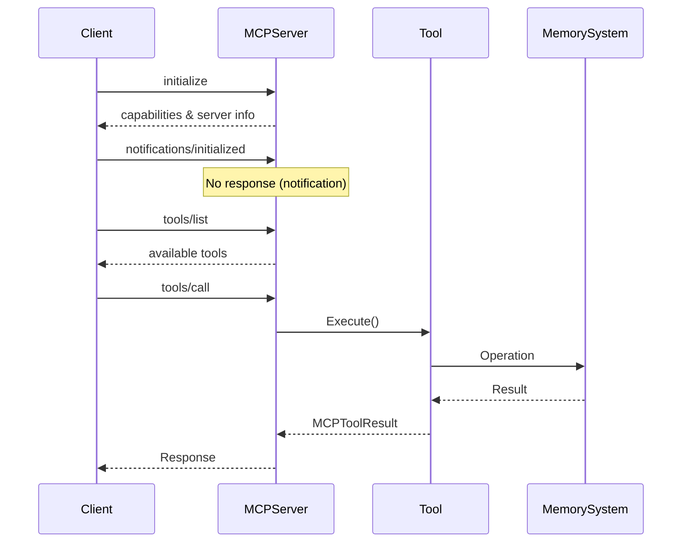

# MCP Server Component Documentation

## Overview

The MCP (Model Context Protocol) server in ZetMem is a JSON-RPC 2.0 compliant server that exposes memory management functionality through standardized tools. It serves as the primary interface for AI models to interact with the Adaptive Memory System.

## Architecture

### Core Components

#### 1. Server Structure (`pkg/mcp/server.go`)

The MCP server implements a standard JSON-RPC 2.0 server with the following structure:

```go
type Server struct {
    logger      *zap.Logger
    tools       map[string]Tool
    initialized bool
    reader      *bufio.Reader
    writer      io.Writer
}
```

**Key Features:**
- Stdio-based communication (reads from stdin, writes to stdout)
- Tool registry pattern for extensibility
- Graceful shutdown support
- Request/notification handling separation

#### 2. Tool Interface

All MCP tools implement this interface:

```go
type Tool interface {
    Name() string
    Description() string
    InputSchema() map[string]interface{}
    Execute(ctx context.Context, args map[string]interface{}) (*models.MCPToolResult, error)
}
```

### Protocol Implementation

#### Message Types

1. **Requests** (with ID field)
   - `initialize` - Handshake and capability negotiation
   - `tools/list` - List available tools
   - `tools/call` - Execute a specific tool

2. **Notifications** (no ID field)
   - `notifications/initialized` - Client initialization complete

#### Error Handling

Standard JSON-RPC 2.0 error codes:
- `-32700` - Parse error
- `-32600` - Invalid request
- `-32601` - Method not found
- `-32602` - Invalid params
- `-32603` - Internal error

### Request/Response Flow



## Server Initialization

The server is initialized in `cmd/server/main.go`:

```go
// 1. Create MCP server
mcpServer := mcp.NewServer(logger.Named("mcp"))

// 2. Register tools
mcpServer.RegisterTool(storeTool)
mcpServer.RegisterTool(retrieveTool)
mcpServer.RegisterTool(evolveTool)
mcpServer.RegisterTool(workspaceInitTool)
mcpServer.RegisterTool(workspaceCreateTool)
mcpServer.RegisterTool(workspaceRetrieveTool)

// 3. Start server
mcpServer.Start(ctx)
```

## Communication Protocol

### JSON-RPC 2.0 Messages

**Request Format:**
```json
{
    "jsonrpc": "2.0",
    "id": 1,
    "method": "tools/call",
    "params": {
        "name": "store_coding_memory",
        "arguments": {
            "content": "function example() { ... }",
            "workspace_id": "my-project"
        }
    }
}
```

**Success Response:**
```json
{
    "jsonrpc": "2.0",
    "id": 1,
    "result": {
        "content": [{
            "type": "text",
            "text": "Memory stored successfully!"
        }]
    }
}
```

**Error Response:**
```json
{
    "jsonrpc": "2.0",
    "id": 1,
    "error": {
        "code": -32602,
        "message": "Invalid params",
        "data": null
    }
}
```

## Tool Registration

Tools are registered during server initialization:

1. **Memory Tools**
   - `StoreCodingMemoryTool`
   - `RetrieveRelevantMemoriesTool`
   - `EvolveMemoryNetworkTool`

2. **Workspace Tools**
   - `WorkspaceInitTool`
   - `WorkspaceCreateTool`
   - `WorkspaceRetrieveTool`

Each tool is instantiated with its dependencies (memory system, workspace service, etc.) and registered with the server.

## Error Handling Patterns

The server implements robust error handling:

1. **Parse Errors**: Invalid JSON is caught and returns parse error
2. **Method Errors**: Unknown methods return method not found
3. **Parameter Validation**: Tools validate their inputs
4. **Execution Errors**: Tool failures are wrapped in error responses
5. **Graceful Disconnection**: EOF is handled as normal client disconnect

## Concurrency and Context

- All tool executions receive a context for cancellation
- The server supports graceful shutdown via context cancellation
- Tools should respect context cancellation for long-running operations

## Security Considerations

1. **Input Validation**: All tool inputs are validated against schemas
2. **Error Information**: Error responses don't leak sensitive information
3. **Resource Limits**: The server should implement timeouts for tool execution
4. **Authentication**: Currently relies on process-level security (stdio)

## Extension Points

To add new tools:

1. Implement the `Tool` interface
2. Register the tool in `main.go`
3. Define appropriate input schema
4. Handle errors gracefully
5. Return structured `MCPToolResult`

## Best Practices

1. **Tool Design**
   - Keep tools focused on single responsibilities
   - Validate all inputs thoroughly
   - Return meaningful error messages
   - Use structured responses

2. **Error Handling**
   - Never panic in tool execution
   - Log errors for debugging
   - Return user-friendly error messages
   - Use appropriate error codes

3. **Performance**
   - Respect context cancellation
   - Implement timeouts for external calls
   - Stream large results if needed
   - Cache expensive operations

## Monitoring and Debugging

The server logs key events:
- Tool registration
- Request/response cycles
- Error conditions
- Client connections/disconnections

Enable debug logging with `--log-level=debug` for detailed traces.