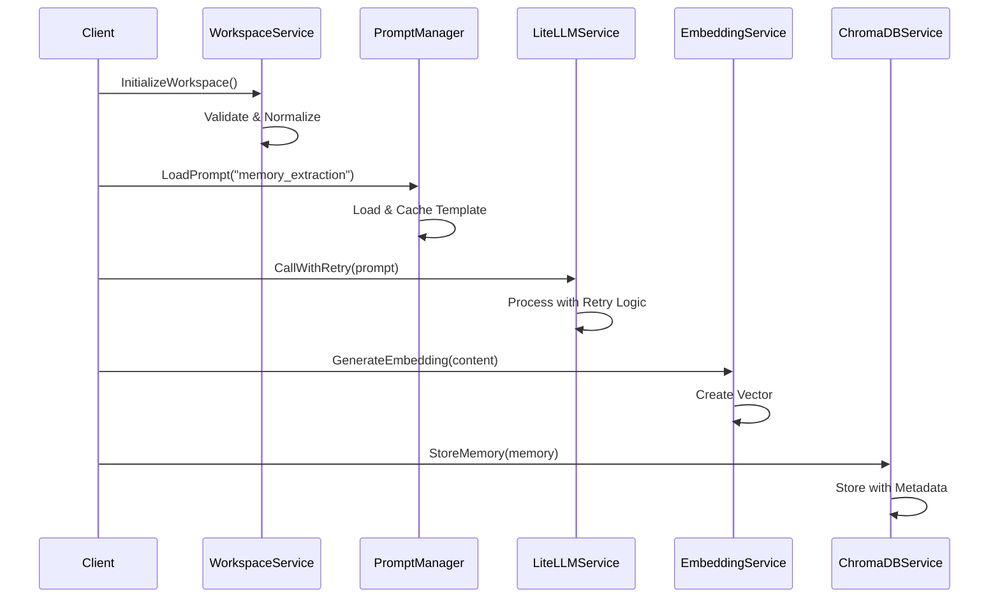
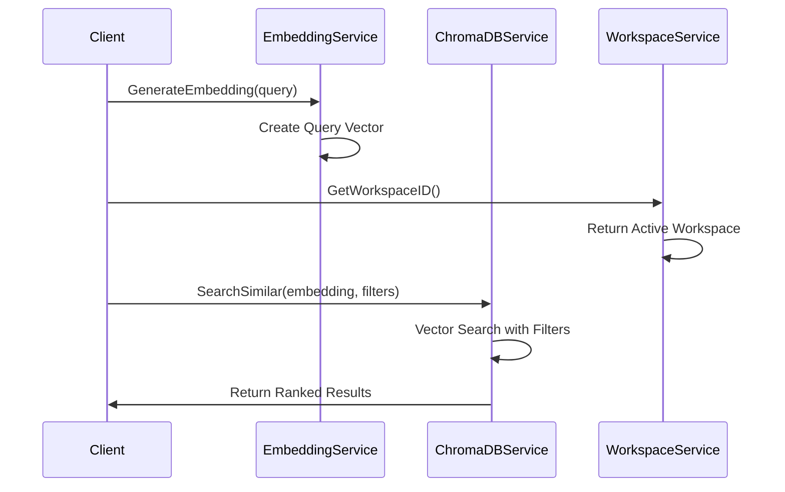

# Service Layer Architecture

## Overview

The ZetMem service layer provides a modular, extensible architecture for AI-powered memory management. Each service is designed with a single responsibility and clear interfaces for integration.

## Core Services

### 1. LiteLLMService

**Purpose**: Manages interactions with Large Language Models through a unified interface.

**Key Features**:
- Unified API for multiple LLM providers
- Automatic retry logic with exponential backoff
- Fallback model support for resilience
- Token usage tracking and optimization
- Support for OpenAI API (currently configured)

**Configuration**:
```go
type LiteLLMConfig struct {
    DefaultModel    string
    FallbackModels  []string
    MaxRetries      int
    Timeout         time.Duration
}
```

**Key Methods**:
- `CallWithRetry()`: Main entry point with automatic retry logic
- `GenerateEmbedding()`: Placeholder for embedding generation (currently uses simple hash)

**Integration Points**:
- Used by memory processing for content analysis
- Provides intelligent context understanding
- Generates structured responses for memory categorization

### 2. ChromaDBService

**Purpose**: Handles vector database operations for semantic memory storage and retrieval.

**Key Features**:
- Persistent vector storage with metadata
- High-performance similarity search
- Collection management (automatic initialization)
- Metadata filtering for targeted searches
- UUID-based collection tracking

**Data Model**:
```go
type ChromaAddRequest struct {
    IDs        []string
    Embeddings [][]float32
    Metadatas  []map[string]interface{}
    Documents  []string
}
```

**Key Methods**:
- `Initialize()`: Creates/verifies collection existence
- `StoreMemory()`: Stores memory with embedding and metadata
- `SearchSimilar()`: Performs semantic similarity search with filters

**Integration Points**:
- Primary storage backend for memory vectors
- Integrates with EmbeddingService for vector generation
- Supports WorkspaceService for memory isolation

### 3. EmbeddingService

**Purpose**: Generates dense vector representations of text for semantic search.

**Key Features**:
- Multiple embedding provider support:
  - OpenAI (text-embedding-ada-002)
  - Sentence Transformers (local models)
  - Fallback hash-based embeddings
- Batch embedding generation
- Configurable model selection
- Environment-based configuration

**Supported Providers**:
1. **OpenAI**: Cloud-based, high-quality embeddings (1536 dimensions)
2. **Sentence Transformers**: Local, privacy-preserving (384 dimensions)
3. **Fallback**: Simple hash-based for testing (384 dimensions)

**Key Methods**:
- `GenerateEmbedding()`: Single text embedding
- `GenerateBatchEmbeddings()`: Efficient batch processing

**Integration Points**:
- Called by memory creation pipeline
- Provides vectors for ChromaDB storage
- Enables semantic search functionality

### 4. PromptManager

**Purpose**: Manages dynamic prompt templates for LLM interactions.

**Key Features**:
- YAML-based prompt configuration
- Template variable substitution
- Model-specific parameters (temperature, tokens)
- Hot reload support for development
- Template caching for performance
- Version control for prompts

**Template Structure**:
```yaml
name: memory_extraction
version: 1.0.0
model_config:
  temperature: 0.1
  max_tokens: 1000
template: |
  Extract key information from the following code:
  {{.Content}}
  
  Focus on:
  - Purpose and functionality
  - Key algorithms
  - Dependencies
```

**Key Methods**:
- `LoadPrompt()`: Loads and caches prompt templates
- `RenderPrompt()`: Renders template with data
- `GetModelConfig()`: Returns model-specific settings

**Integration Points**:
- Used by LiteLLMService for structured prompts
- Supports multiple prompt types (extraction, analysis, query)
- Enables consistent LLM interactions

### 5. WorkspaceService

**Purpose**: Provides logical isolation and organization of memories.

**Key Features**:
- Workspace creation and management
- Filesystem path or logical name support
- Automatic workspace detection
- Memory count tracking
- Workspace metadata management

**Workspace Types**:
1. **Filesystem-based**: Uses project directories as workspaces
2. **Logical**: Named workspaces for organization
3. **Default**: Fallback for unassigned memories

**Key Methods**:
- `InitializeWorkspace()`: Smart create-or-retrieve
- `ValidateWorkspaceID()`: Input validation
- `GetWorkspaceInfo()`: Retrieves workspace statistics
- `WorkspaceExists()`: Checks for existing memories

**Integration Points**:
- Filters ChromaDB queries by workspace
- Enables multi-project memory isolation
- Supports context switching

## Service Interactions

### Memory Creation Flow



### Memory Retrieval Flow



## Configuration Management

### Environment Variables

```bash
# LLM Configuration
OPENAI_API_KEY=your-api-key

# Embedding Service
EMBEDDING_SERVICE_URL=http://localhost:8080
EMBEDDING_SERVICE=sentence-transformers

# ChromaDB
CHROMADB_URL=http://localhost:8000
CHROMADB_COLLECTION=zetmem_memories
```

### Service Dependencies

```go
// Service initialization order
1. ChromaDBService (database connection)
2. EmbeddingService (may depend on external services)
3. LiteLLMService (requires API keys)
4. PromptManager (loads templates)
5. WorkspaceService (requires ChromaDB)
```

## Error Handling

### Retry Strategies

1. **LiteLLMService**: Exponential backoff with fallback models
2. **ChromaDBService**: Connection retry with health checks
3. **EmbeddingService**: Provider fallback chain

### Error Types

```go
// Service-specific errors
- ErrInvalidWorkspace
- ErrEmbeddingFailed
- ErrPromptNotFound
- ErrLLMTimeout
- ErrChromaDBConnection
```

## Performance Considerations

### Caching

- **PromptManager**: Template and compiled template caching
- **ChromaDBService**: Collection UUID caching
- **WorkspaceService**: Workspace metadata caching

### Batch Operations

- **EmbeddingService**: Batch embedding generation
- **ChromaDBService**: Bulk memory storage

### Connection Pooling

- HTTP clients with configurable timeouts
- Persistent connections for ChromaDB

## Security Considerations

1. **API Key Management**: Environment variables, never hardcoded
2. **Input Validation**: All services validate inputs
3. **Workspace Isolation**: Memories are segregated by workspace
4. **Prompt Injection**: Template validation prevents injection

## Monitoring and Observability

Each service includes:
- Structured logging with zap
- Performance metrics (token usage, latency)
- Error tracking and reporting
- Debug mode for development

## Extension Points

### Adding New LLM Providers

1. Implement provider-specific client
2. Add to fallback chain
3. Configure model parameters

### Custom Embedding Models

1. Implement embedding interface
2. Add provider configuration
3. Update dimension handling

### Storage Backends

1. Implement storage interface
2. Add migration support
3. Update query builders

## Best Practices

1. **Service Isolation**: Each service has a single responsibility
2. **Interface Design**: Clear contracts between services
3. **Error Propagation**: Wrap errors with context
4. **Configuration**: External configuration for flexibility
5. **Testing**: Unit tests for each service
6. **Documentation**: Keep service docs updated