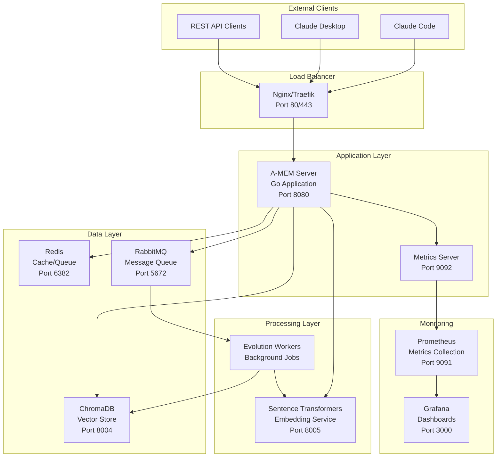
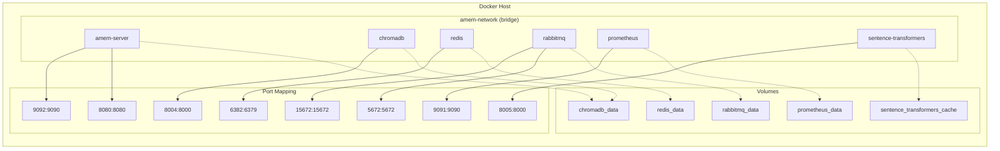
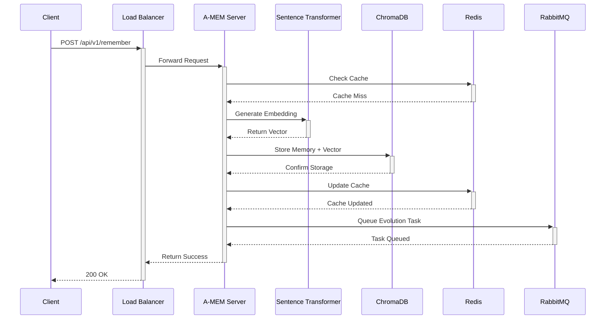
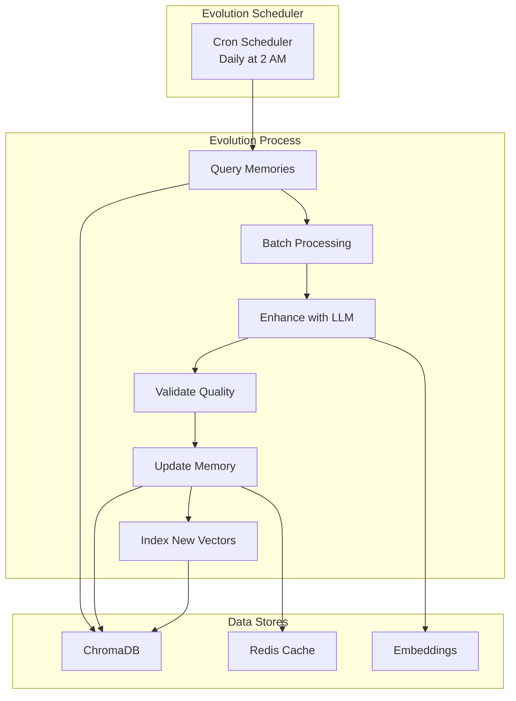
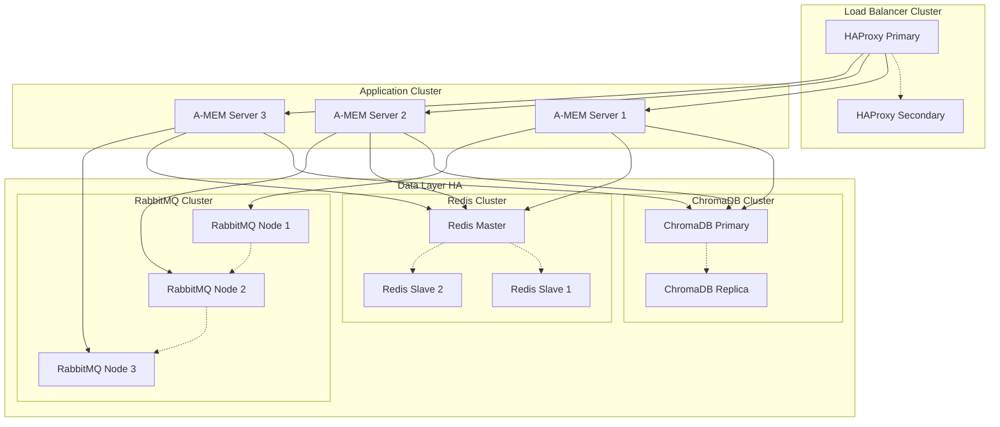
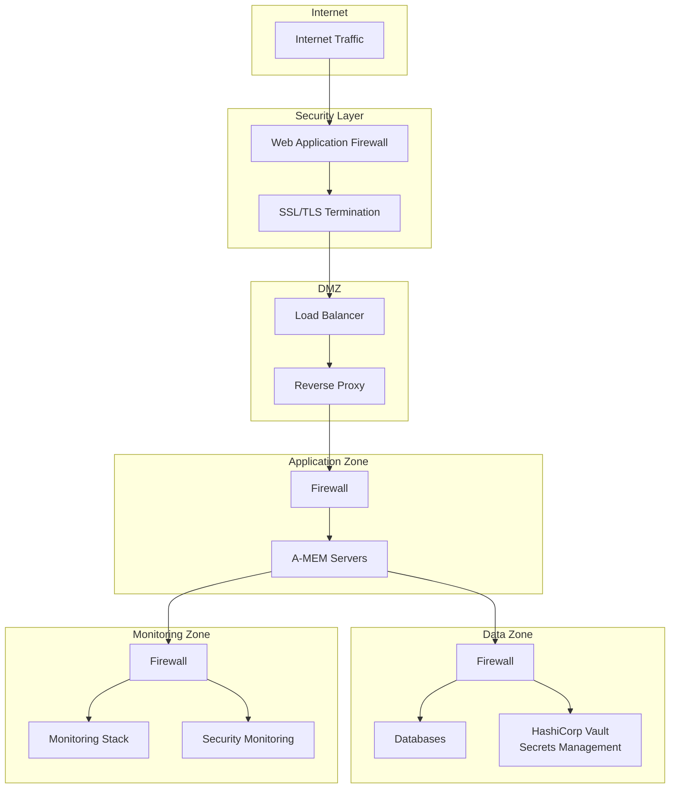
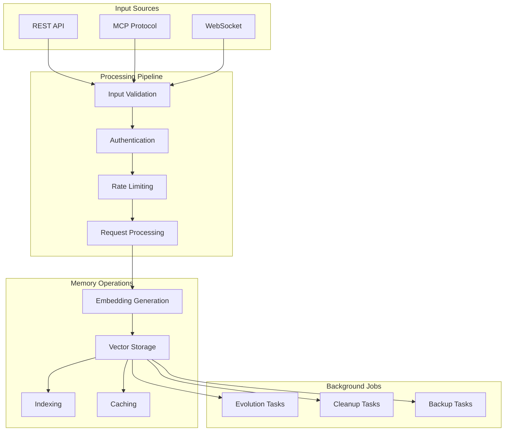

# A-MEM MCP Server Architecture Diagrams

## System Architecture Overview

## Container Network Architecture

## Request Flow Diagram

## Memory Evolution Process

## High Availability Architecture

## Security Architecture

## Deployment Pipeline

```mermaid
graph LR
    subgraph "Development"
        DEV[Local Docker]
        TEST[Unit Tests]
    end
    
    subgraph "CI/CD"
        GIT[Git Push]
        CI[GitHub Actions]
        BUILD[Docker Build]
        SCAN[Security Scan]
        PUSH[Push to Registry]
    end
    
    subgraph "Staging"
        STAGE[Staging Cluster]
        E2E[E2E Tests]
        PERF[Performance Tests]
    end
    
    subgraph "Production"
        PROD[Production Cluster]
        MON2[Monitoring]
        ALERT[Alerting]
    end
    
    DEV --> TEST
    TEST --> GIT
    GIT --> CI
    CI --> BUILD
    BUILD --> SCAN
    SCAN --> PUSH
    PUSH --> STAGE
    STAGE --> E2E
    E2E --> PERF
    PERF --> PROD
    PROD --> MON2
    MON2 --> ALERT
```

## Data Flow Architecture

## Infrastructure Components

| Component | Purpose | Technology | Scaling Strategy |
|-----------|---------|------------|------------------|
| Load Balancer | Traffic distribution | Nginx/HAProxy | Active-passive HA |
| API Server | Request handling | Go + Gin | Horizontal scaling |
| Vector Database | Memory storage | ChromaDB | Replication |
| Cache Layer | Performance | Redis | Master-slave |
| Message Queue | Async processing | RabbitMQ | Clustering |
| Embedding Service | Vector generation | Sentence Transformers | Load balanced |
| Monitoring | Observability | Prometheus + Grafana | Single instance |

## Network Security Zones

| Zone | Components | Access Rules |
|------|------------|--------------|
| Public | Load Balancer | HTTPS only |
| DMZ | Reverse Proxy | From Public only |
| Application | A-MEM Servers | From DMZ only |
| Data | Databases | From Application only |
| Management | Monitoring | VPN access only |

## Resource Requirements

| Component | CPU | Memory | Storage | Network |
|-----------|-----|--------|---------|---------|
| A-MEM Server | 2-4 cores | 2-4 GB | 10 GB | 1 Gbps |
| ChromaDB | 4-8 cores | 8-16 GB | 100+ GB SSD | 1 Gbps |
| Redis | 2 cores | 4-8 GB | 10 GB | 10 Gbps |
| RabbitMQ | 2 cores | 2-4 GB | 10 GB | 1 Gbps |
| Sentence Transformers | 4 cores | 4-8 GB | 20 GB | 1 Gbps |
| Prometheus | 2 cores | 2-4 GB | 50+ GB | 1 Gbps |